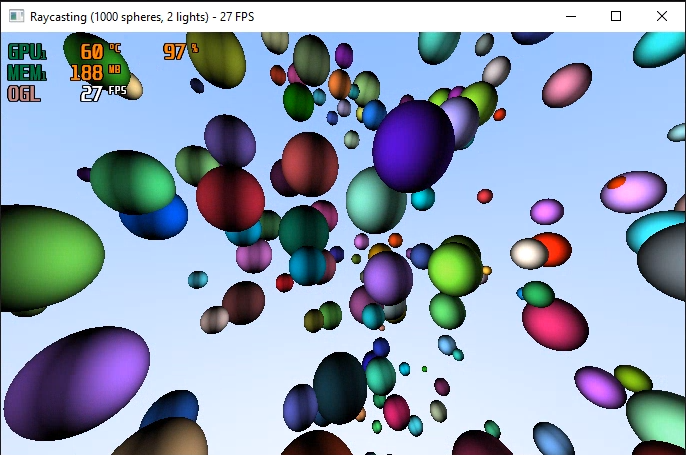

# Raycasting-CUDA
This is a simple application using C++ and Nvidia CUDA for rendering a scene with a 1000 spheres using raycasting algorithm.

Nvidia CUDA 11.0 is necessary to build and launch the application. It also uses CuRAND library for randomizing spheres' positions, radiuses and colors.

## Controls schema
---

* (W, S, A, D) - camera movement (forward, backwards, left and right),
* (+, -) - camera movement up and down,
* (Q, E) - camera rotation to left and right,
* ([, ]) - changing lights quantity (from 0 to 256),
* (T) - switching between static and dynamic lights,
* (C) - switching between white lights and colored lights,
* (N, M) - changing specular value in Phong formula.

---

## Rendered scene:

